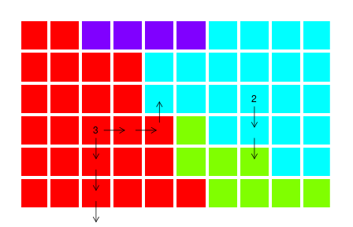

Recently, I tackled a problem where I needed to find the **center of a solid-colored region** in an image. The image was represented as a one-dimensional array of integers (colors), and the target was to find all the pixels of a specific color that are **deepest inside** the region—meaning, the furthest away from any edge or differently-colored pixel.

Example of the deepest pixels for colors red and blue:



---

The "depth" of a pixel is defined as the minimum number of steps (up, down, left, right) required to reach the **image boundary** or a **differently-colored pixel**. Pixels with the **greatest depth** are considered the center of their region.

---

To solve this problem efficiently (even for huge images), I used a two-pass **Breadth-First Search (BFS)** approach:

We first locate all the boundary pixels of the region of interest (those touching another color or the edge of the image).

Starting from the boundary pixels, we expand inward using BFS and compute the "depth" of each pixel from the edge.

Finally, we collect the pixels whose depth is the largest—these are the central pixels!

---

Full Java code:
```java
import java.util.List;
import java.util.ArrayList;
import java.util.Queue;
import java.util.LinkedList;

// Assuming Image class contains:
// - int[] pixels
// - int width, height
public class Central_Pixels_Finder extends Image {

    public int[] central_pixels(int colour) {
        int size = width * height;
        boolean[] visited = new boolean[size];
        int[] depth = new int[size];
        Queue<Integer> queue = new LinkedList<>();

        // Step 1: Add all boundary pixels of the given color to the queue
        for (int y = 0; y < height; y++) {
            for (int x = 0; x < width; x++) {
                int idx = y * width + x;
                if (pixels[idx] == colour && isBoundary(x, y, colour)) {
                    queue.add(idx);
                    visited[idx] = true;
                    depth[idx] = 0;
                }
            }
        }

        // Step 2: BFS inward to compute depths
        int maxDepth = 0;
        int[][] directions = {{1, 0}, {-1, 0}, {0, 1}, {0, -1}};
        while (!queue.isEmpty()) {
            int idx = queue.poll();
            int x = idx % width;
            int y = idx / width;

            for (int[] d : directions) {
                int nx = x + d[0];
                int ny = y + d[1];

                if (inBounds(nx, ny)) {
                    int nIdx = ny * width + nx;
                    if (!visited[nIdx] && pixels[nIdx] == colour) {
                        visited[nIdx] = true;
                        depth[nIdx] = depth[idx] + 1;
                        maxDepth = Math.max(maxDepth, depth[nIdx]);
                        queue.add(nIdx);
                    }
                }
            }
        }

        // Step 3: Gather all pixels with maximum depth
        List<Integer> result = new ArrayList<>();
        for (int i = 0; i < size; i++) {
            if (pixels[i] == colour && depth[i] == maxDepth) {
                result.add(i);
            }
        }

        // Convert List<Integer> to int[]
        int[] array = new int[result.size()];
        for (int i = 0; i < result.size(); i++) {
            array[i] = result.get(i);
        }

        return array;
    }

    // Helper: Check if coordinates are within bounds
    private boolean inBounds(int x, int y) {
        return x >= 0 && x < width && y >= 0 && y < height;
    }

    // Helper: Check if pixel is on the boundary of the color region
    private boolean isBoundary(int x, int y, int colour) {
        int[][] directions = {{1, 0}, {-1, 0}, {0, 1}, {0, -1}};
        for (int[] d : directions) {
            int nx = x + d[0];
            int ny = y + d[1];
            if (!inBounds(nx, ny)) return true; // Edge of image
            int neighborIdx = ny * width + nx;
            if (pixels[neighborIdx] != colour) return true; // Different color neighbor
        }
        return false;
    }
}
```


This approach is efficient and scalable:
- Linear time: We only visit each pixel once.
- Memory-safe: No recursion—BFS uses a queue.
- Accurate: Finds true center based on geometric depth.

## Final Thoughts
This problem was a fun blend of image processing and graph traversal. It reminded me how often classic algorithms like BFS can be applied in visual or spatial problems—like identifying regions, centers, or borders in 2D data.

If you're curious to try it yourself, check out the challenge on codewars: https://www.codewars.com/kata/58c8c723df10450b21000024/


__*Happy coding!*__