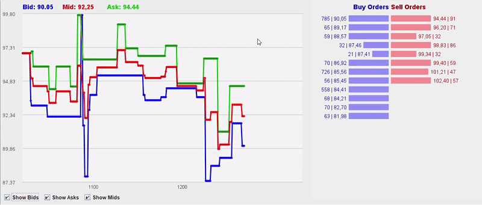

Trading systems and matching engines have always fascinated me — especially how exchanges juggle thousands of buy and sell orders in real time. So, I built a Java-based **Order Book Simulator** to model how markets actually work behind the scenes.

It runs on **Java 21**, with no dependencies, and simulates a full order flow: limit orders, market orders, matching, price updates, and even expiration logic. It even has a UI panel to visualize how the book moves.

---

## What Does It Do?

- Matches **limit and market orders** in real time  
- Tracks **best bid/ask**, **mid price**, and **trade history**  
- Supports **order expiration** (to simulate time decay)  
- Has a basic **UI with live updates**  
- All built from scratch in Java

Here’s what it looks like in action:



---

## Peek Inside the Engine

In this blog post I will show you the important pieces to make this app work. 

### Project structure
```
src/
├── com.afrancodev.orderbook/
│   ├── OrderBookSimulator.java   # Application entry point
│   ├── SimulationEngine.java     # Application main loop
│   ├── OrderBook.java            # Order management
│   └── OrderGenerator.java       # Random order generator
│
├── com.afrancodev.orderbook.models/
│   ├── Order.java                # Order representation
|   ├── Trade.java                # Trade model
│   ├── TradeHistory.java         # Trade History model
│   └── PriceLevelData.java       # Aggregator of Prices and Quantities
│
├── com.afrancodev.orderbook.ui/
│   ├── MainPanel.java            # Main Ui Panel
|   ├── OrderBookPanel.java       # Order Book Panel 
│   └── PriceChartPanel.java      # Price Chart Panel
```

---

### 🧠 `SimulationEngine`: The Heartbeat Loop

This method runs every tick of the simulation. It updates the fair price, generates a new random order, injects it into the book, and refreshes the UI:

```java
private void engineLoop() {
    orderGenerator.updateFairPrice();

    Order order = orderGenerator.generateRandomOrder(orderBook);

    orderBook.addOrder(order);
    orderBook.matchOrders();
    orderBook.updatePrices();
    orderBook.expireOldOrders();

    mainPanel.repaint();
}
```

Short and sweet. It’s the brain of the simulation.

---

### 🎲 `OrderGenerator`: Random Order Flow

This class simulates traders with randomized behavior. It chooses whether to place a market or limit order, whether to buy or sell, and what price/quantity to use — all based on configured probabilities.

```java
public Order generateRandomOrder(OrderBook orderBook) {
    ThreadLocalRandom rand = ThreadLocalRandom.current();

    boolean isBuy = rand.nextBoolean();
    boolean isMarketOrder = rand.nextDouble() <= MARKET_ORDER_PROBABILITY;

    double limitPrice;
    if (isMarketOrder) {
        Double bestBid = orderBook.getCurrentBid();
        Double bestAsk = orderBook.getCurrentAsk();
        limitPrice = isBuy
                ? (bestAsk != null ? bestAsk : fairPrice)
                : (bestBid != null ? bestBid : fairPrice);
    } else {
        double priceOffset = rand.nextDouble(0, SPREAD_WIDTH);
        limitPrice = isBuy ? fairPrice - priceOffset : fairPrice + priceOffset;
    }

    boolean isLargeOrder = rand.nextDouble() < LARGE_ORDER_PROBABILITY;
    int quantity = isLargeOrder
            ? rand.nextInt(LARGE_ORDER_MIN, LARGE_ORDER_MAX)
            : rand.nextInt(SMALL_ORDER_MIN, SMALL_ORDER_MAX);

    int age = rand.nextInt(MIN_AGE, MAX_AGE);

    return new Order(isBuy, round(limitPrice), quantity, isMarketOrder, age);
}
```

By tweaking probabilities, you can simulate everything from stable markets to volatile chaos.

---

### ⚖️ `OrderBook`: Matching Engine Logic

Here’s the core of the exchange: matching orders using **price-time priority**. Market orders match immediately. Limit orders wait if they can’t cross the spread.

```java
public void matchOrders() {
    synchronized (lock) {
        while (!buyOrders.isEmpty() && !sellOrders.isEmpty()) {
            Order buy = buyOrders.peek();
            Order sell = sellOrders.peek();

            if (buy.isMarketOrder() && sell.isMarketOrder()) {
                break;
            }

            boolean canMatch = buy.isMarketOrder() || sell.isMarketOrder() || buy.getPrice() >= sell.getPrice();
            if (!canMatch) {
                break;
            }

            int tradedQty = Math.min(buy.getQuantity(), sell.getQuantity());
            double tradePrice = determineTradePrice(buy, sell);

            tradeHistory.recordTrade(new Trade(true, tradePrice, tradedQty));

            buy.reduceQuantity(tradedQty);
            sell.reduceQuantity(tradedQty);

            if (buy.getQuantity() == 0) {
                buyOrders.poll();
            }
            if (sell.getQuantity() == 0) {
                sellOrders.poll();
            }
        }
    }
}
```

It’s clean, thread-safe, and surprisingly satisfying to watch in motion.

---

## Try It Yourself

You can run it with Java 21 + Maven:

```bash
mvn clean compile exec:java
```

No libraries needed — just clone and run.

---

## What’s Next?

Some ideas on the roadmap:
- 🕯️ Candlestick chart type  
- ⏸️ Pause/resume simulation  
- ⚙️ Settings panel (spread, speed, order size)  
- 📊 Global metrics (order stats, time elapsed)

---

This project was a fun way to combine Java skills with a deeper understanding of how real markets work. 
If you're curious about trading systems or building simulations, definitely give it a try.

Let me know what your suggestions or if you want you can fork it and make it your own.
The code is on my [github](https://github.com/afrancodev/order-book-simulator).

_**Happy Coding!**_